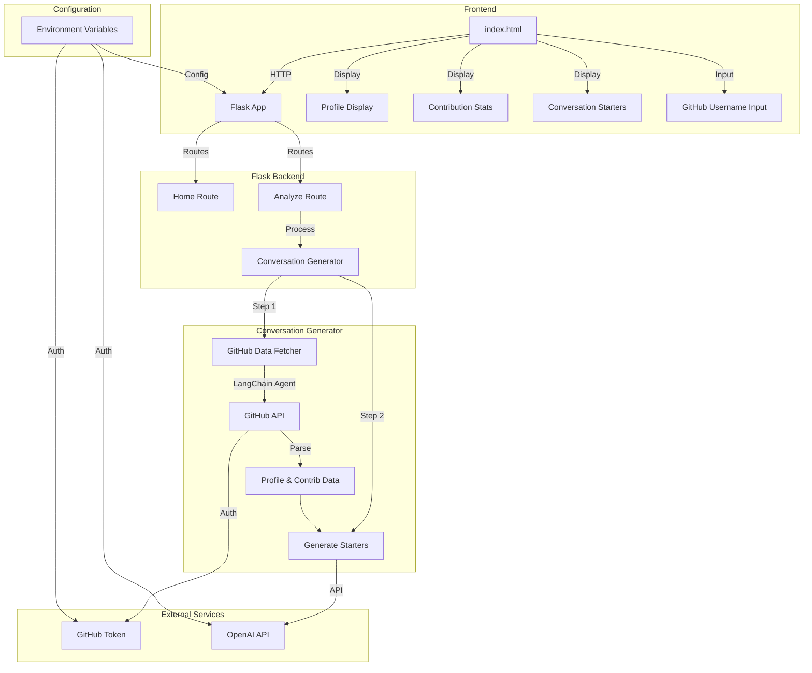

# GitHub Conversation Starter - Mermaid Architecture

```mermaid
graph TD
    subgraph Frontend
        A[index.html] --> |"HTTP"| B["Flask App"]
        A --> |"Display"| D["Profile Display"]
        A --> |"Display"| E["Contribution Stats"]
        A --> |"Display"| F["Conversation Starters"]
        A --> |"Input"| C["GitHub Username Input"]
    end

    subgraph "Flask Backend"
        B --> |"Routes"| G["Home Route"]
        B --> |"Routes"| H["Analyze Route"]
        H --> |"Process"| M["Conversation Generator"]
    end

    subgraph "Conversation Generator"
        M --> |"Step 1"| I["GitHub Data Fetcher"]
        I --> |"LangChain Agent"| J["GitHub API"]
        J --> |"Parse"| K["Profile & Contrib Data"]
        M --> |"Step 2"| L["Generate Starters"]
        K --> L
    end

    subgraph "External Services"
        J --> |"Auth"| N["GitHub Token"]
        L --> |"API"| O["OpenAI API"]
    end

    subgraph Configuration
        P["Environment Variables"] --> |"Config"| B
        P --> |"Auth"| N
        P --> |"Auth"| O
    end
```
